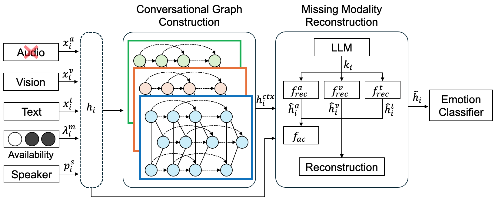

# Context-Aware Dynamic Graph Learning for Multimodal Emotion Recognition with Missing Modalities

## Abstract

We introduce a novel framework for multimodal emotion recognition that effectively handles missing modality scenarios.
Our approach combines adaptive dialogue graphs, LLM-guided context extraction, and cross-modal semantic alignment with dynamic graph ODEs, achieving state-of-the-art results on IEMOCAP and MELD.

## 🖼️ Architecture
<div align="center">
  
  <p><i>Overview of our proposed framework. The model first constructs a conversational graph, then reconstructs missing modalities using LLM-guided features and alignment modules before final emotion classification.</i></p>
</div>
## Main Results

Performance on multimodal emotion recognition benchmarks:

| Dataset | Complete |Average(Acc)|Average(F1)| 
|---------|----------|------------|-----------|
| IEMOCAP | 73.63    | 69.16      | 73.74     |
| MELD    | 65.8%    | 69.13      | 70.22     |

## 🚀 Quick Start

```python
from models import CADGL
import torch

# Initialize model
model = CADGL(config)

# Forward pass with missing modalities
output = model(
    audio=audio_features,      # Can be None
    visual=visual_features,     # Can be None  
    text=text_features,         # Can be None
    modality_masks=masks
)
```

## 📋 Requirements

Core dependencies:
```
torch>=2.0.0
torch-geometric
torchdiffeq
transformers
numpy
```

## 🗂️ Repository Structure

```
├── models/           # Model architecture
├── configs/          # Configuration files
├── scripts/          # Training and evaluation scripts
```

## 💾 Pretrained Models

Pretrained models will be made available upon paper acceptance.

For early access, please contact the authors.

## 📊 Dataset Preparation

Please refer to the respective dataset papers for download instructions:
- IEMOCAP: [Link](https://sail.usc.edu/iemocap/)
- MELD: [Link](https://github.com/declare-lab/MELD)

Feature extraction details are provided in Section 3.2 of our paper.

## 🔬 Training

Basic training command:
```bash
python scripts/train.py --config configs/default.yaml
```

For detailed training procedures and hyperparameters, please refer to our paper.

## 📝 Citation

This work is currently **under review**.  
A full citation will be provided upon paper acceptance.  

## 📧 Contact

For questions and collaborations, please open an issue or contact us at rlaalfl05043@gmail.com.
